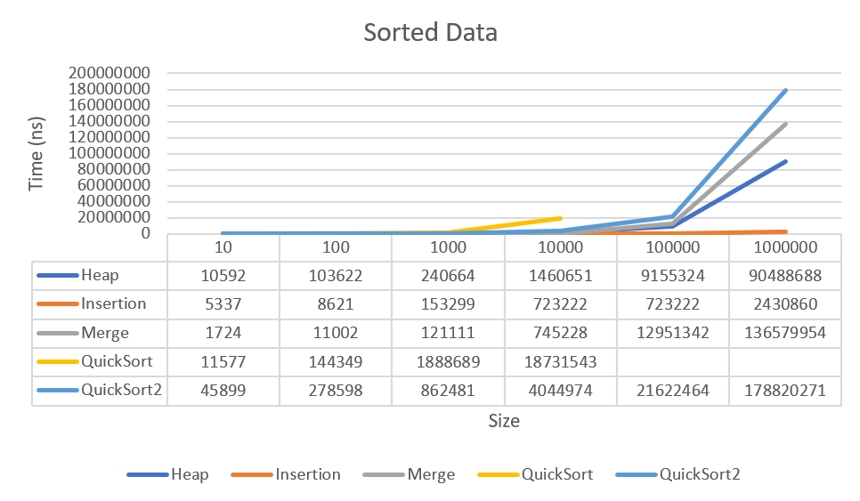
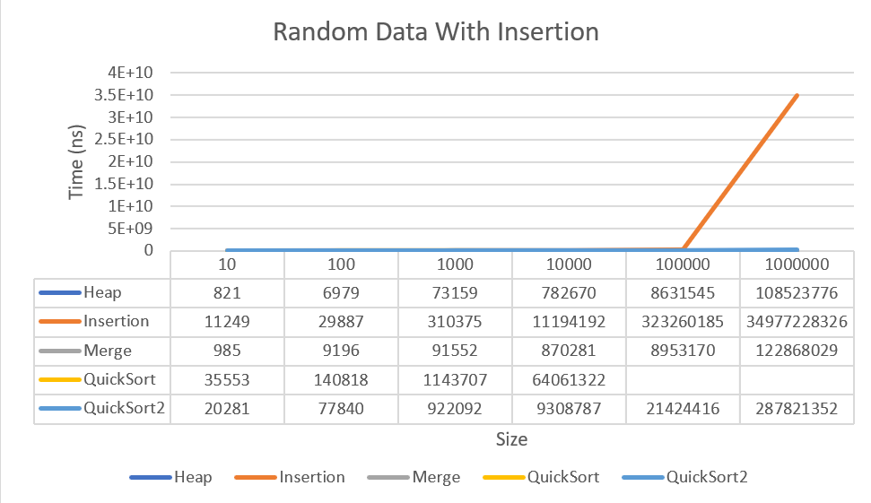
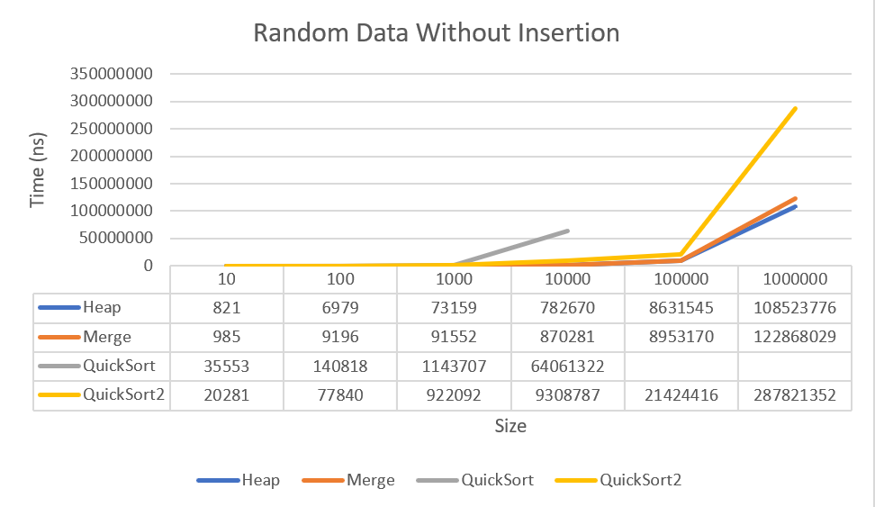
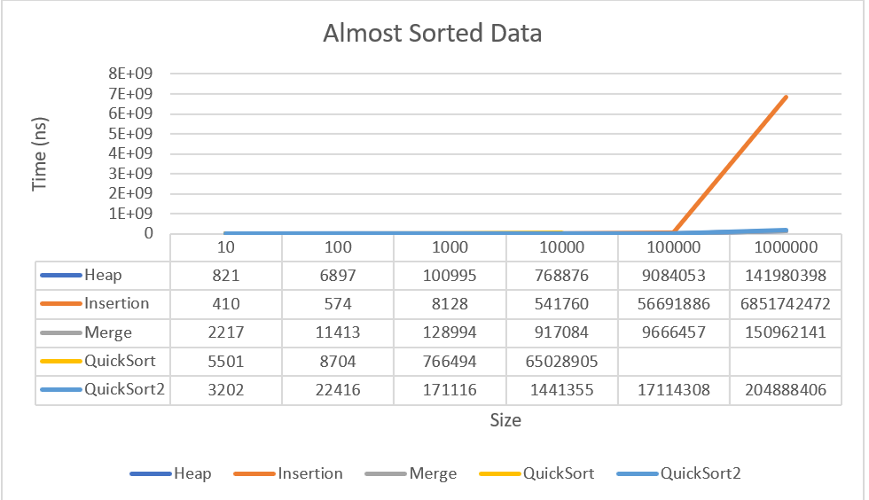
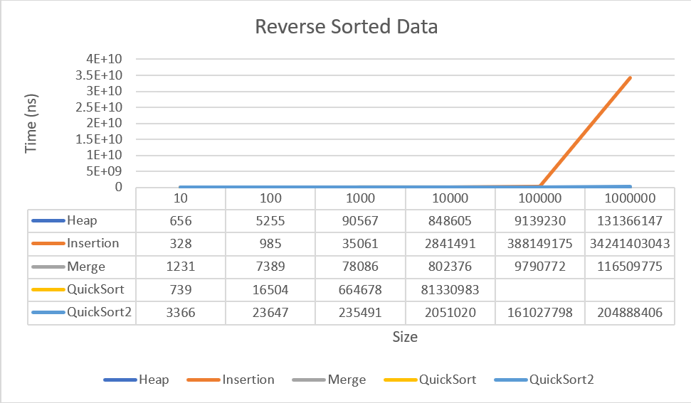
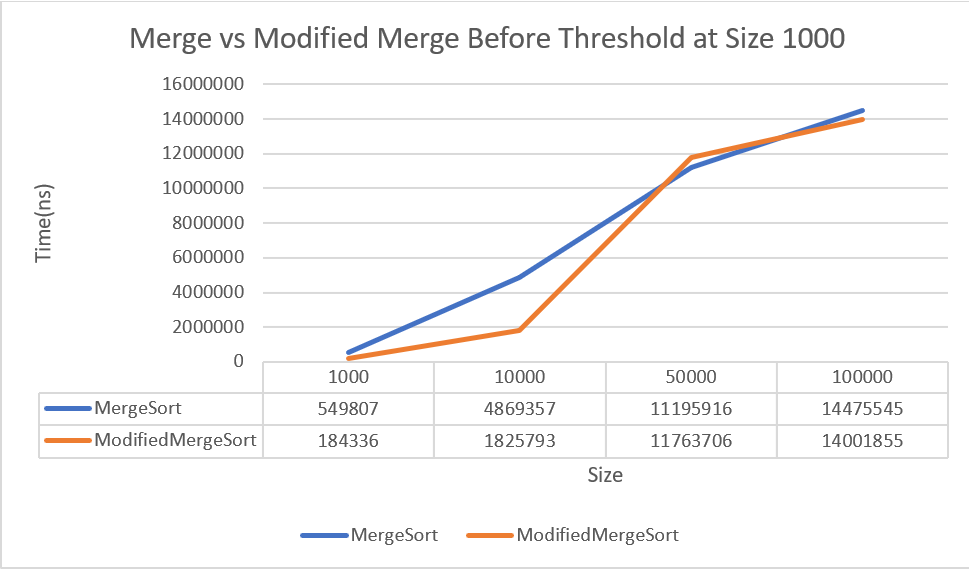
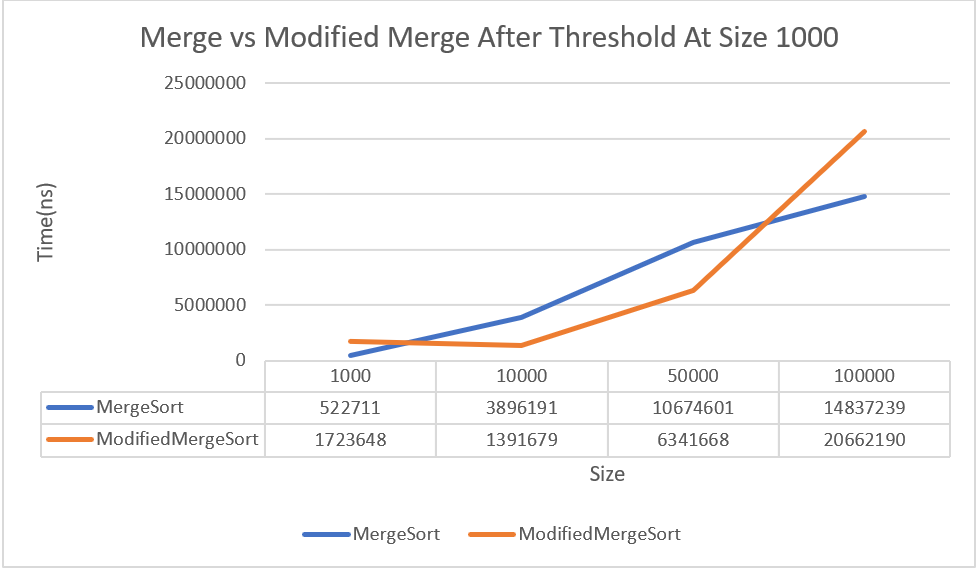

# Sorting Algorithm Growth Analysis

## algo1

### Sorted Data

Stack overflow exception occurs for data size 100000 and 1000000 in quick sort.

### Random Data

Stack overflow exception occurs for data size 100000 and 1000000 in quick sort.

### Almost Sorted Data

Stack overflow exception occurs for data size 100000 and 1000000 in quick sort.

### Reverse Sorted Data

Stack overflow exception occurs for data size 100000 and 1000000 in quick sort.

---

## algo2

Considering an array of size 1000 for the threshold, we get **k=22** at size 1000.  

So, after that, the plot is like this:

